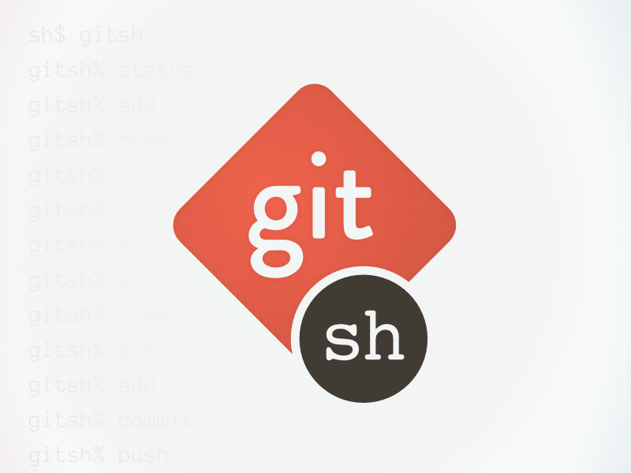

<h1 align="center">
  
</h1>

<h3 align="center">
  Git UI Application using the <a href="https://developer.github.com/v3/">GitHub API</a>
</h3>

<p align="center">
  

  <a href="https://www.linkedin.com/in/laurabeatris/">
    
  </a>

  

  <a href="https://github.com/LauraBeatris/2budget/stargazers">
    
  </a>
</p>

<p align="center">
  <a href="#rocket-about-the-project">About the project</a>&nbsp;&nbsp;&nbsp;|&nbsp;&nbsp;&nbsp;
  <a href="#checkered_flag-installation">Installation</a>&nbsp;&nbsp;&nbsp;|&nbsp;&nbsp;&nbsp;
  <a href="#memo-licence">Licence</a>
</p>

<hr>

## :rocket: About the project
**Codio** is a **Git UI Application** made with the <a href="https://developer.github.com/v3/">GitHub API</a>. After authenticating with your github username, you're able to see your repositories with their Commits, Issues, Pull Request and also the quantity of Forks, Stars and Contributors. 
The issues and pull requests views are able to filter with the state, like closed, open or all, and also, at the other info views are applied data pagination.

<hr>

## :checkered_flag: Installation 

Install the dependecies 

``` 
  yarn install 
```
And then, run locally 
``` 
  yarn start
```

Putting the **NODE_ENV** environment variable as development you can do API calls with your token. So you'll be able to access more endpoints like user notifications. For that, go to your GitHub Profile Setting and create a token, after this, copy it and put in a environment variable called **REACT_APP_GIT_TOKEN** 

These headers will be included to your requests 
```
    Content-Type: 'application/json',
    Accept: 'application/vnd.github.v3.raw',
    Authorization: `token ${process.env.REACT_APP_GIT_TOKEN}
```

<br>


## :memo: Licence

MIT Licence. See the file [LICENSE](https://github.com/LauraBeatris/codio/blob/master/LICENSE) for more details.

---

If you have some problem with the documentation, just send a pull request that i'll be happy to help. 😃

Made with ♥ by Laura :wave: [See my linkedin!](https://www.linkedin.com/in/laurabeatris/)
