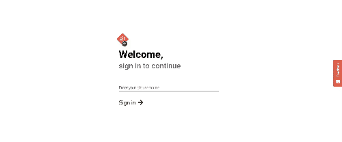

<p align="left">
   
</p>

# Codio

[](https://github.com/LauraBeatris)
[](#)
[](https://github.com/LauraBeatris/codio/stargazers)
[](https://github.com/LauraBeatris/codio/network/members)
[](https://github.com/LauraBeatris/codio/graphs/contributors)

> Git UI made with the [GitHub API](https://developer.github.com/v3/)

<p align="center">
  
</p>
<br>
<p align="center">
  
</p>
<br>

---

# :pushpin: Table of Contents

* [Features](#rocket-features)
* [Installation](#construction_worker-installation)
* [Getting Started](#runner-getting-started)
* [FAQ](#postbox-faq)
* [Found a bug? Missing a specific feature?](#bug-issues)
* [Contributing](#tada-contributing)
* [License](#closed_book-license)

# :rocket: Features

* 🧭 Explore repositories
* 👩🏻‍💻 See all the data related to the activies of your Github Account

# :construction_worker: Installation

**You need to install [Node.js](https://nodejs.org/en/download/) and [Yarn](https://yarnpkg.com/) first, then in order to clone the project via HTTPS, run this command:**

```git clone https://github.com/LauraBeatris/codio.git```

SSH URLs provide access to a Git repository via SSH, a secure protocol. If you have a SSH key registered in your Github account, clone the project using this command:

```git clone git@github.com:LauraBeatris/codio.git```

**Install dependencies**

```yarn install```

# :runner: Getting Started

Setting the **NODE_ENV** environment variable as development, gives you the ability to do API calls with your token. So you'll be able to access more endpoints like user notifications. For that, go to your GitHub Profile Setting and create a token, after that, copy it and put in a environment variable called **REACT_APP_GIT_TOKEN**

These headers will be included to your requests
```
    Content-Type: 'application/json',
    Accept: 'application/vnd.github.v3.raw',
    Authorization: `token ${process.env.REACT_APP_GIT_TOKEN}
```
Run the following command in order to start the application in a development environment:

```yarn start```

# :postbox: Faq

**Question:** What are the tecnologies used in this project?

**Answer:** The tecnologies used in this project are [React](https://pt-br.reactjs.org/) + [Styled Components](https://styled-components.com/) to handle scoped CSS.

# :bug: Issues

Feel free to **file a new issue** with a respective title and description on the the [Codio](https://github.com/LauraBeatris/codio/issues) repository. If you already found a solution to your problem, **i would love to review your pull request**! Have a look at our [contribution guidelines](https://github.com/LauraBeatris/codio/blob/master/CONTRIBUTING.md) to find out about the coding standards.

# :tada: Contributing

Check out the [contributing](https://github.com/LauraBeatris/codio/blob/master/CONTRIBUTING.md) page to see the best places to file issues, start discussions and begin contributing.

# :closed_book: License

Released in 2019.
This project is under the [MIT license](https://github.com/LauraBeatris/codio/master/LICENSE).

Made with love by [Laura Beatris](https://github.com/LauraBeatris) 💜🚀
